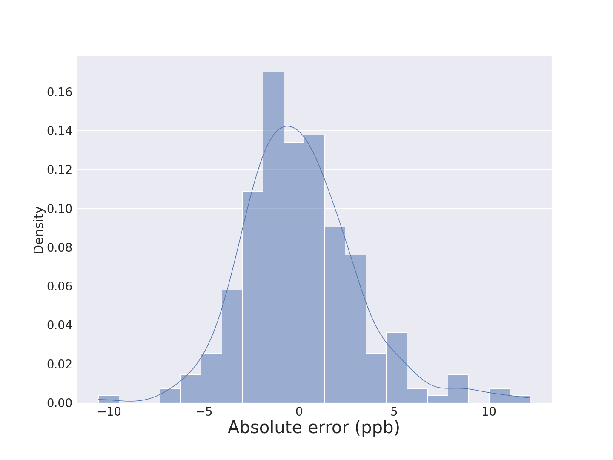

## 3. Results

Figure (code) shows the architecture of the neural network used that achieved the best performance. 
Many choices made regarding were governed by two main motives; reducing the complexity of the model and ensuring the model captures the entire range of concentrations in the training data. 
The reduction of complexity in the model was important due to many the 

The final model was further analyzed using two major parameters: squared error and absolute error.
Squared error penalizes predictions further from the observed concentrations, which is beneficial for detecting outliers and anomalies in the data. 
The squared error is also related to the root mean squared error, the measured used to determine the best model in the Kaggle competition meaning it can provide insights on the individual monitors in the training data. 
The problem is that the loss function used was the mean squared error, meaning that only using this metric can may cause us to fail to observe other possible problems while training the data.
Absolute error as a criterion for analysis fills these gaps in knowledge, such as bias in the training data or the geographic distribution of the error. 

{}

Figure H (histogram) shows the distribution for the absolute error on the training data. 
The distribution is nearly gaussian, which is expected with a large sample size.
The distribution is also centered on 0 and has a very small skew, meaning that there is no bias in the when the model was training.
The major difference between the distribution and a Gaussian distribution is the kurtosis.
The kurtosis was found to be greater than 3, meaning that the data is more concentrated near the mean with some extreme outliers. 
This is interesting because since the loss function of the model was mean squared error, these outliers should be minimized.

Figure A (Absolute value map) shows the geographic distribution of the absolute error. 
This figure shows that the absolute error is not spatially homogenous, with most of the outliers being in the West. 
Further analysis shows 75% of the outliers were in contained in the Western region mostly in suburban areas outside of major cities that were surrounded by nature. 
Another characteristic of the outliers were that they were mainly found in suburban areas near isolated major urban areas. 

All the previous analysis was done on the training data but to ensure our model is robust, the model needs to be run on other data. 
The model was run on 165 samples and the root mean squared error was found to be 2.925, which is lower than the root mean squared error on the training data (3.05). 
This means that the final model is robust and can be applicable across the United States.  
